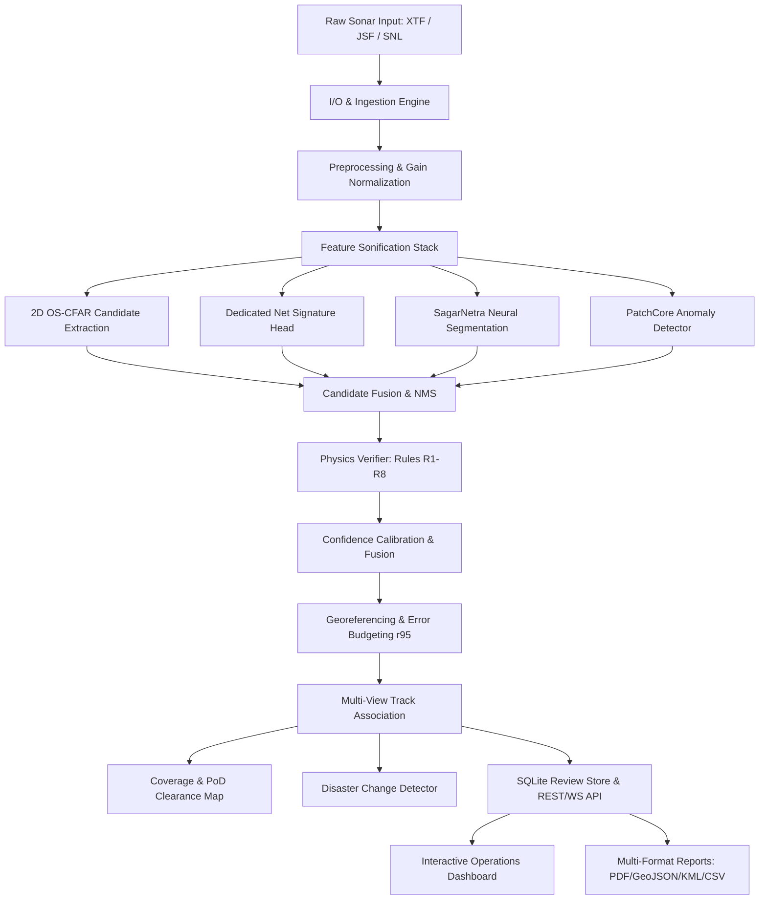

# SagarNetra Architecture Specification
**Automated Underwater Marine Debris & Anomaly Detection System**  
**SIH 2026 Problem Statement 26057 | NIOT / Ministry of Earth Sciences**

---

## 1. System Overview

SagarNetra is a modular, physics-grounded pipeline that processes raw side-scan sonar (SSS) waterfall records into georeferenced, physically validated marine hazard intelligence. The entire stack is architected to run completely offline on survey vessels (laptop CPU or edge Jetson Orin) without cloud dependencies.

---

## 2. Core Subsystems

### 2.1 SonarForge Simulator & Injector (`sonarforge/`)
* **Acoustic Ray Engine:** Implements 2.5D profile ray tracing with Lambertian backscatter, spherical/cylindrical transmission loss, and frequency-dependent absorption ($\alpha \approx 0.10\text{ dB/m}$ at 450 kHz, $0.30\text{ dB/m}$ at 900 kHz).
* **Seabed Presets:** Procedural generation of Indian seabed types:
  1. `EAST_COAST_SAND` (Chennai / Visakhapatnam shelf)
  2. `WEST_COAST_MUD` (Mumbai / Kutch shelf)
  3. `REEF_RUBBLE` (Gulf of Mannar / Lakshadweep)
  4. `SEAGRASS_BED` (Palk Bay)
  5. `HARBOUR_FLOOR` (Basin debris, blocks, chains)
* **Hybrid Injector (`inject.py`):** Paints synthetic ghost nets and debris into real background imagery while preserving local $K$-distribution speckle and background noise floors.

### 2.2 Preprocessing & Feature Sonification (`preprocess/`)
* **Bottom Tracking:** Gradient energy thresholding with Kalman filtering to determine real-time towfish altitude.
* **Slant-Range Correction:** Projects slant range $r$ to ground distance $x = \sqrt{r^2 - H^2}$, eliminating the nadir water column and normalizing pixel resolution to 0.10 m/pixel.
* **Gain & Despeckle:** Sliding-window Empirical Gain Normalization (EGN) coupled with a $7 \times 7$ Enhanced Lee despeckle filter.
* **3-Channel Feature Stack:**
  - **Ch 0:** Despeckled normalized acoustic intensity.
  - **Ch 1:** Inverse-CFAR acoustic shadow probability map.
  - **Ch 2:** Sato continuous ridge eigenvalue map (enhances netting twines, ropes, and pipelines).

### 2.3 Multi-Head Detection & Anomaly Engine (`detect/`)
* **OS-CFAR:** Order-Statistic Constant False Alarm Rate detector pairing bright acoustic highlights with down-range shadow extinction zones.
* **Net Signature Head:**
  - Laplacian-of-Gaussian (LoG) detector targeting periodic air/foam floats ($0.08\text{ m} - 0.5\text{ m}$).
  - Minimum Spanning Tree (MST) polyline graph search scoring float spacing consistency ($\text{CV} < 0.35$).
  - Gabor multi-orientation filter bank targeting periodic net mesh textures ($2 - 8\text{ px}$).
* **Neural Segmentation:** Lightweight multi-scale convolutional segmentation head producing pixel-accurate masks for 6 hazard classes.
* **PatchCore Anomaly Head:** Coreset-subsampled nearest-neighbor feature bank from normal seabed tiles, flagging unexpected debris (`unknown_manmade`).

### 2.4 Physics Verifier & Confidence Fusion (`verify/`, `confidence/`)
* **Acoustic Elevation Solver:**
  $$h = H \cdot \frac{L_s}{x_0 + L_s}$$
* **Rule Engine (R1–R8):**
  - **R1:** Class-specific physical height ceiling.
  - **R2:** Highlight-before-shadow range sequencing.
  - **R3:** Port/Starboard acoustic cross-talk mirror rejection.
  - **R4:** Along-track beam footprint persistence check.
  - **R5:** Water-column suspended multipath veto.
  - **R6:** Nadir and surface-reflection mask.
  - **R7:** Along-track resolution adequacy check.
  - **R8:** Seafloor slope instability penalty.
* **Confidence Fusion:** Temperature-scaled calibrated probability $p_{cal}$ fused with observation quality $Q_{obs}$, physics score $V_{phys}$, net signature $S_{net}$, and multi-view count.

### 2.5 Georeferencing, Clearance & Change (`geo/`, `coverage/`, `change/`)
* **Catenary Layback:** Towfish position derived from vessel GPS, tow cable length, and fish depth.
* **UTM Projection:** Auto-selection of Indian UTM Zones (EPSG:32643 / 32644 / 32645) using `pyproj`.
* **Honest Error Budget ($r_{95}$):**
  $$\sigma_{total}^2 = \sigma_{gps}^2 + \sigma_{layback}^2 + (x \cdot \sigma_{heading})^2 + \sigma_{range}^2 + (v \cdot \sigma_t)^2, \quad r_{95} = 2.45 \cdot \sigma_{total}$$
* **Coverage Clearance Grid:** 1 m cell resolution tracking simulation-backed PoD for reference targets (`REF_NET`, `REF_CYL`), generating second-look infill tracks.
* **Disaster Change Detection:** Sub-pixel image registration, log-ratio backscatter subtraction, and morphological grouping to isolate post-cyclone fairways hazards.

---

## 3. Storage and Interfacing
* **Database:** Embedded SQLite (`artifacts/sagarnetra.db`) storing surveys, ping streams, target metadata, rule audit logs, and operator reviews.
* **API:** FastAPI asynchronous server with WebSocket streaming (`/ws/waterfall`) and multi-format exporters (JSON, CSV, GeoJSON, KML, PDF).
* **Frontend:** High-performance HTML5/Vanilla CSS/Canvas operations console designed for high-contrast visibility in bright bridge or dark vessel cabin conditions.
